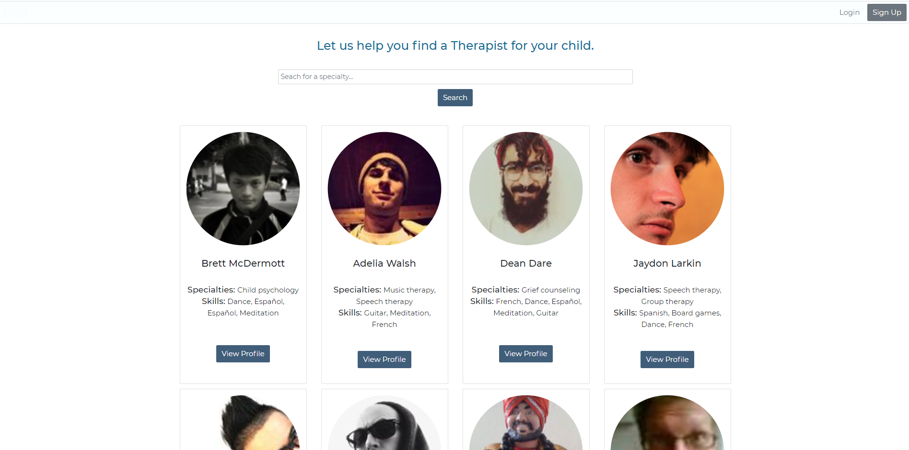
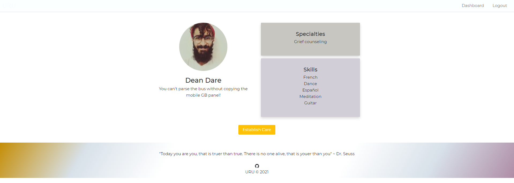

# URU

"Today you are you, that is truer than true. There is no one alive, that is youer than you." ~ Dr. Seuss

## Description:

URU is an economic and social empowerment application that builds a connection between child and behavior therapist.

One of the most familiar challenge a Behavior Therapist encounter is that they do not have time to perform proper assessment of the patient they will work with.
Agencies or employers usually assigns a therapist without proper knowledge about a child with developmental disability.
URU improves the functionality of a dating app. It establishes initial connections between the parent and the behavior therapist and then the child.

With the robust data that URU is able to collect from these entities, it will be easier for Behavior Therapists to have a clear match with their patient and therefore
effectively provide optimal services to the child with Applied Behavior Therapy needs.

## Motivation for development

Create an application that builds long lasting connection between a behavior therapist and your child.

## User story:

AS A parent in need of therapy services for my child
I WANT to find a Behavior Therapist for my child
SO THAT I will have peace of mind that my child is working with a Therapist with significant knowledge about him/her.

## Functionality and Features:

After creating an account a user will be able to search a therapist, view a therapist profile, and see their child's file and associated therapist. You can send emails to therapist's sharing your intent to seek care with them.

## Technologies:

This MERN app runs in the browser and features:

-REACT
-GraphQL
-Mongoose
-MongoDB
-Email-js
-Faker
-Bootstrap
-JSON Web Token
-Deployed with Heroku

## Links:

Github Repo: https://github.com/acevezl/uru

URU: https://uru.herokuapp.com/

### Contributors

- Nell-E https://github.com/nellirism
- Luis https://github.com/acevezl
- Patrick https://github.com/patricklago21
- Brad https://github.com/smithfamily42
- Abel https://github.com/codenameabel

### License

MIT License is used for this project. Please refer to the license.txt file for more details.
